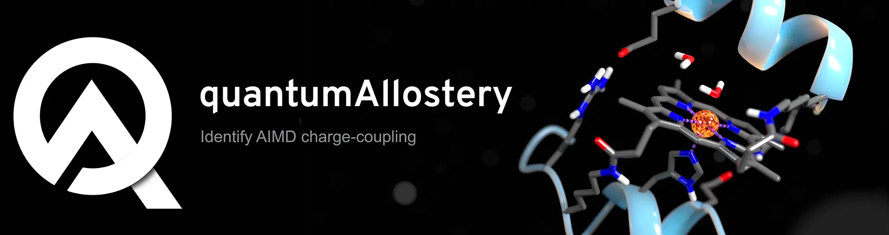

quantumAllostery
==============================
[//]: # (Badges)
[](https://github.com/davidkastner/quantumAllostery/actions?query=workflow%3ACI)
[](https://quantumallostery.readthedocs.io/en/latest/?badge=latest)


## Table of Contents
1. **Overview**
2. **Installation**
    * Creating python environment
    * Install pyQMMM package
    * Install machine learning dependencies
    * Setup developing environment
3. **What is included?**
    * File structure
    * Command line interface
4. **Documentation**
    * Update documentation
    * Examples
5. **Developer Guide**
    * GitHub refresher


## 1. Overview
The quantumAllostery (QA) package automates the identification of charge coupling interactions in ab-initio molecular dynamics (AIMD) simulations.
Routine tasks can be easily automated using the functionality contained in the library.

## 2. Installation
Install the package by running the follow commands inside the repository.
This will perform a developmental version install.
It is good practice to do this inside of a virtual environment.
A yaml environmental file has been created to automate the installation of dependencies.

### Setup developing environment
Remember to update your GitHub [ssh keys](https://docs.github.com/en/authentication/connecting-to-github-with-ssh/adding-a-new-ssh-key-to-your-github-account).

```
git clone git@github.com:davidkastner/quantumAllostery.git
cd quantumAllostery
```

### Setup developing environment
Remember to update your GitHub [ssh keys](https://docs.github.com/en/authentication/connecting-to-github-with-ssh/adding-a-new-ssh-key-to-your-github-account).
```bash
git clone git@github.com:davidkastner/quantumAllostery.git
cd quantumAllostery
```

### Creating python environment
All the dependencies can be loaded together using the prebuilt environment.yml.
Compatibility is automatically tested for python versions 3.8 and higher.
Installing all packages together via the yaml will produce a more robust and efficient environment.

```
conda env create -f environment.yml
<<<<<<< HEAD
conda activate qa # You may need to use source activate qa
=======
conda activate qa
source activate qa # Alternatively used on some clusters
```

### Install pyQMMM package
Next, we will perform an development install:

```
cd quantumAllostery
>>>>>>> f5af0aefcdaa4972b0cc56425e959eb3732fb473
python -m pip install -e .
```

### Install Machine Learning Dependencies
If you are planning to use the ML functionality, then you will need to install Demystifying.
Demystifying is a package that and demonstration of finding features in high-dimensional simulaitions.
Unfortunately, it does not have a conda install so you can get it and install it from GitHub.
We are currently building an inhouse package to replace this dependency: [molecuLearn](https://github.com/davidkastner/molecuLearn/).
Demystifying doesn't have a proper install setup so you can just add it to your python path in your bashrc.

```
git clone git@github.com:delemottelab/demystifying.git
export PYTHONPATH="${PYTHONPATH}:/my/path/to/demystifying-master" # Add to bashrc
```

*Citation:*
**Fleetwood, Oliver, et al. "Molecular insights from conformational ensembles via machine learning." Biophysical Journal (2019).**


<<<<<<< HEAD

=======
>>>>>>> f5af0aefcdaa4972b0cc56425e959eb3732fb473
## 3. What is included?
### File structure
This is the the package structure for reference and its included modules.

```
.
|── cli.py          # Command-line interface entry point
├── docs            # Readthedocs documentation site
├── qa              # Directory containing the quantumAllostery modules
│   ├── process     # Processes the raw AIMD data
│   ├── predict     # Machine learning analysis
│   ├── manage      # File management functionality and routines
│   ├── analyze     # Data analysis to combine process and plot routines
│   ├── reference   # Definitions and conversion dictionaries for amino acids
│   └── plot        # Automated plotting and vizualization 
└── ...
```

### Command Line Interface
The contents of the library are designed to be navigated through the commandline interface.
Add the following line to your bash.rc

```
alias qa='python /the/path/to/quantumAllostery/cli.py'
```

Now you can call the quantumAllostery package CLI from anywhere with:
```
qa
```


## 4. Documentation
### Update documentation
Run the following commands to update the ReadTheDocs site:

```bash
make clean
make html
```


## 5. Developer guide
### GitHub refresher for those who would like to contribute
#### Push new changes

```
git status
git pull
git add -A .
git commit -m "Change a specific functionality"
git push -u origin main
```

#### Handle merge conflict

```
git stash push --include-untracked
git stash drop
git pull
```

### Copyright
Copyright (c) 2022, David W. Kastner


#### Acknowledgements
[MolSSI](https://github.com/molssi/cookiecutter-cms) version 1.1.
